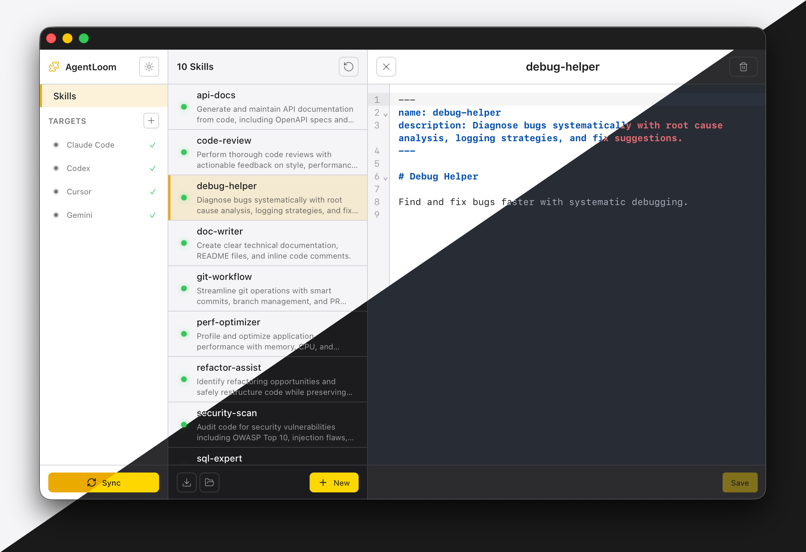

<p align="center">
  
</p>

<h1 align="center">AgentLoom</h1>

<p align="center">
  <strong>One place to manage all your AI agent skills</strong>
</p>

<p align="center">
  <a href="https://github.com/Alpha-Coders/agent-loom/releases"></a>
  <a href="LICENSE"></a>
  <a href="https://github.com/Alpha-Coders/agent-loom/actions"></a>
</p>

<p align="center">
  <a href="#features">Features</a> •
  <a href="#installation">Installation</a> •
  <a href="#supported-tools">Supported Tools</a> •
  <a href="#development">Development</a> •
  <a href="docs/ARCHITECTURE.md">Architecture</a>
</p>

---

## What is AgentLoom?

AgentLoom is a desktop app that lets you manage AI agent skills from a single location. It works with any tool that supports the [agentskills.io](https://agentskills.io) open format. Instead of manually copying skills to each tool's directory, it maintains a central repository and syncs them via symlinks.

<p align="center">
  
</p>

```
~/.claude/skills/my-skill           →  ~/.agentloom/skills/my-skill
~/.cursor/skills-cursor/my-skill    →  ~/.agentloom/skills/my-skill
~/.codex/skills/my-skill            →  ~/.agentloom/skills/my-skill
```

## Features

- **Unified Management** — Create, edit, and organize all your skills in one place
- **Multi-Target Sync** — One click to sync skills across all your AI tools
- **Built-in Editor** — Full-featured markdown editor with syntax highlighting (CodeMirror 6)
- **Validation** — Validates skills against the [agentskills.io](https://agentskills.io) specification with auto-fix
- **Import** — Import existing skills from any target, folder, or via drag-and-drop
- **Theme Support** — System, light, and dark themes with native macOS integration
- **Cross-Platform** — Works on macOS, Windows, and Linux

## Supported Tools

AgentLoom works with any tool that supports the [agentskills.io](https://agentskills.io) specification:

| Tool | Vendor | Skills Directory |
|------|--------|------------------|
| Claude Code | Anthropic | `~/.claude/skills/` |
| Codex | OpenAI | `~/.codex/skills/` |
| Gemini CLI | Google | `~/.gemini/skills/` |
| Cursor | Anysphere | `~/.cursor/skills-cursor/` |
| Amp | Sourcegraph | `~/.amp/skills/` |
| Goose | Block | `~/.goose/skills/` |
| Roo Code | Roo | `~/.roo-code/skills/` |
| OpenCode | Anthropic | `~/.opencode/skills/` |
| Vibe | Vibe | `~/.vibe/skills/` |
| Firebender | Firebender | `~/.firebender/skills/` |
| Mux | Mux | `~/.mux/skills/` |
| Autohand | Autohand | `~/.autohand/skills/` |

You can also add custom folder targets for tools not listed above.

## Installation

### macOS (Homebrew)

The recommended way to install on macOS:

```bash
brew tap Alpha-Coders/agentloom https://github.com/Alpha-Coders/agent-loom.git
brew install --cask --no-quarantine agentloom
```

To upgrade:
```bash
brew upgrade --cask agentloom
```

### Windows

Download the [latest release](https://github.com/Alpha-Coders/agent-loom/releases/latest) and run the installer.

### Linux

```bash
# Download the AppImage from the latest release
chmod +x AgentLoom-*.AppImage
./AgentLoom-*.AppImage
```

<details>
<summary>Manual macOS installation (without Homebrew)</summary>

1. Download the `.dmg` from [releases](https://github.com/Alpha-Coders/agent-loom/releases/latest)
2. Open the DMG and drag `AgentLoom.app` to Applications
3. Before first launch, open Terminal and run:
   ```bash
   xattr -cr /Applications/AgentLoom.app
   ```
4. Now you can open AgentLoom normally

> The app is not code-signed with an Apple Developer certificate. Without the `xattr` command, macOS will show a "damaged" error. This is a [known limitation](https://support.apple.com/en-us/102445) for open-source apps.
</details>

## Development

### Prerequisites

- [Rust](https://rustup.rs/) (via rustup)
- [Node.js](https://nodejs.org/) 18+
- [Tauri CLI v2](https://v2.tauri.app/)

### Quick Start

```bash
# Install Tauri CLI
cargo install tauri-cli --version "^2"

# Install dependencies
npm install

# Run development server
npm run tauri dev
```

### Build

```bash
npm run tauri build
```

### Project Structure

See [Architecture Documentation](docs/ARCHITECTURE.md) for detailed technical information.

## Contributing

Contributions are welcome! Please feel free to submit a Pull Request.

## Tech Stack

| Component | Technology |
|-----------|------------|
| Backend | Rust |
| Framework | Tauri v2 |
| Frontend | Svelte 5 + TypeScript + Vite |
| Editor | CodeMirror 6 |
| Icons | Lucide |

## Credits

Built with [Tauri](https://tauri.app/), [Svelte](https://svelte.dev/), and [Lucide](https://lucide.dev/) icons.

## License

[MIT](LICENSE)
