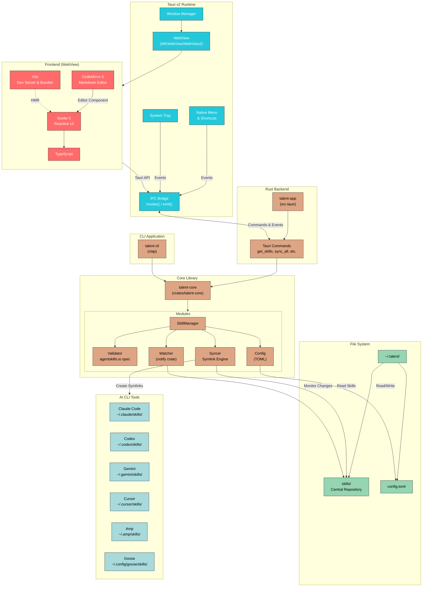

# Talent

A cross-platform GUI application for managing Agent Skills across multiple AI CLI tools.

## Overview

Talent provides a unified interface to manage AI agent skills (like Claude Code skills, Codex skills, etc.) from a single location. Instead of manually copying skills to each tool's directory, Talent maintains a central skill repository and syncs them via symlinks.

## Architecture

```
~/.talent/
├── config.toml          # Application configuration
└── skills/              # Central skill storage
    ├── my-skill/
    │   └── SKILL.md
    └── another-skill/
        └── SKILL.md

~/.claude/skills/        # Symlinks to ~/.talent/skills/*
~/.codex/skills/         # Symlinks to ~/.talent/skills/*
~/.gemini/skills/        # Symlinks to ~/.talent/skills/*
```

## Features

- **Unified Management**: Manage all your AI skills from one place
- **Multi-Target Sync**: Automatically sync skills to Claude, Codex, Gemini, Cursor, Amp, and Goose
- **Validation Engine**: Validate skills against agentskills.io rules before deployment
- **File Watching**: Auto-sync on skill changes
- **Cross-Platform**: Works on macOS, Windows, and Linux

## Tech Stack

| Component | Technology |
|-----------|------------|
| Backend | Rust |
| Framework | Tauri v2 |
| Frontend | Svelte 5 + TypeScript + Vite |
| Editor | CodeMirror 6 |
| File Watching | notify crate |
| CLI | clap |

## Architecture Diagram



### Data Flow

1. **User Interaction** → Svelte UI captures events
2. **Frontend → Backend** → `invoke()` calls Tauri commands
3. **Commands → Core** → Business logic in `talent-core`
4. **Core → File System** → Read/write skills, create symlinks
5. **File System → Targets** → Symlinks point to central skill storage
6. **Backend → Frontend** → Events emitted via `emit()` for updates

## Project Structure

```
talent/
├── Cargo.toml                    # Workspace configuration
├── crates/
│   ├── talent-core/              # Core library
│   │   └── src/
│   │       ├── config.rs         # Configuration management
│   │       ├── error.rs          # Error types
│   │       ├── skill.rs          # Skill model
│   │       ├── target.rs         # Target (CLI tool) model
│   │       ├── validator.rs      # Skill validation
│   │       ├── syncer.rs         # Symlink synchronization
│   │       ├── watcher.rs        # File system watching
│   │       └── manager.rs        # Integration layer
│   └── talent-cli/               # CLI application
│       └── src/main.rs
├── src-tauri/                    # Tauri backend
│   └── src/
│       ├── main.rs
│       ├── lib.rs
│       └── commands.rs           # Tauri commands
├── src/                          # Svelte frontend
│   ├── main.ts
│   ├── App.svelte
│   └── app.css
└── package.json
```

## CLI Usage

```bash
# Sync skills to all targets
talent sync

# Sync to specific target
talent sync --target claude

# List all skills
talent list

# Create new skill
talent new my-skill

# Validate skills
talent validate --all

# Show targets
talent targets

# Show configuration
talent config

# Diagnose issues
talent doctor
```

## Supported Targets

| Target | Skills Path |
|--------|-------------|
| Claude Code | `~/.claude/skills/` |
| OpenAI Codex | `~/.codex/skills/` |
| Gemini CLI | `~/.gemini/skills/` |
| Cursor | `~/.cursor/skills/` |
| Amp | `~/.amp/skills/` |
| Goose | `~/.config/goose/skills/` |

## Development

### Prerequisites

- Rust (via rustup)
- Node.js 18+
- Tauri CLI v2

### Setup

```bash
# Install Rust
curl --proto '=https' --tlsv1.2 -sSf https://sh.rustup.rs | sh

# Install Tauri CLI
cargo install tauri-cli --version "^2"

# Install frontend dependencies
npm install

# Run development server
npm run tauri dev
```

### Building

```bash
# Build for production
npm run tauri build
```

## License

MIT
