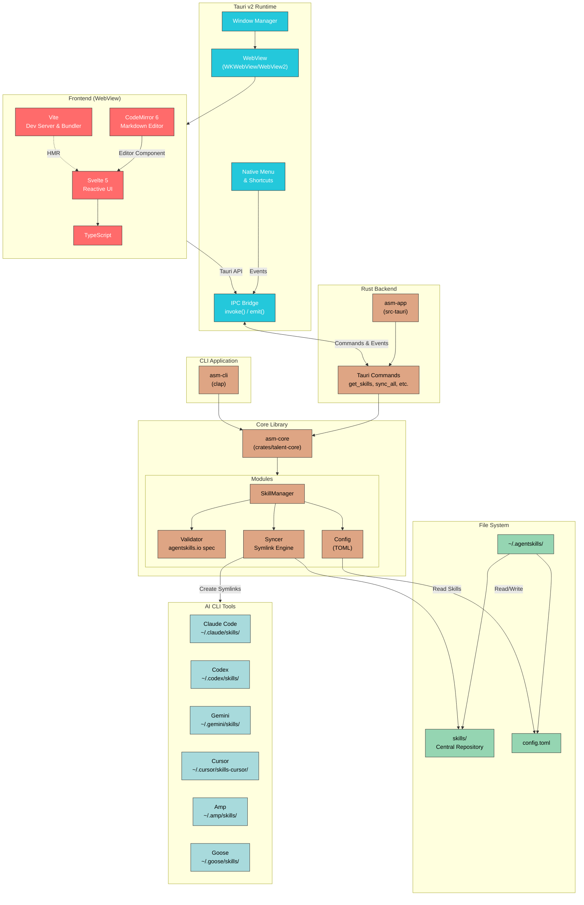

# Architecture

This document describes the technical architecture of Agent Skills Manager.

## Overview

Agent Skills Manager (ASM) is built with a Rust backend (Tauri v2) and a Svelte 5 frontend. The core logic lives in a separate `asm-core` crate, making it reusable across the GUI app and CLI.

## System Diagram



## Data Flow

1. **User Interaction** → Svelte UI captures events
2. **Frontend → Backend** → `invoke()` calls Tauri commands
3. **Commands → Core** → Business logic in `asm-core`
4. **Core → File System** → Read/write skills, create symlinks
5. **File System → Targets** → Symlinks point to central skill storage

## Project Structure

```
agent-skills-manager/
├── Cargo.toml                    # Workspace configuration
├── crates/
│   ├── talent-core/              # Core library (asm-core)
│   │   └── src/
│   │       ├── config.rs         # Configuration management
│   │       ├── error.rs          # Error types
│   │       ├── skill.rs          # Skill model
│   │       ├── target.rs         # Target (CLI tool) model
│   │       ├── validator.rs      # Skill validation
│   │       ├── syncer.rs         # Symlink synchronization
│   │       └── manager.rs        # Integration layer
│   └── talent-cli/               # CLI application (asm-cli)
│       └── src/main.rs
├── src-tauri/                    # Tauri backend (asm-app)
│   └── src/
│       ├── main.rs
│       ├── lib.rs
│       └── commands.rs           # Tauri commands
├── src/                          # Svelte frontend
│   ├── main.ts
│   ├── App.svelte
│   └── lib/
└── package.json
```

## Tech Stack

| Component | Technology |
|-----------|------------|
| Backend | Rust |
| Framework | Tauri v2 |
| Frontend | Svelte 5 + TypeScript + Vite |
| Editor | CodeMirror 6 |
| CLI | clap 4 |

## Storage Layout

```
~/.agentskills/
├── config.toml          # Application configuration
└── skills/              # Central skill storage
    ├── my-skill/
    │   └── SKILL.md
    └── another-skill/
        └── SKILL.md

~/.claude/skills/        # Symlinks → ~/.agentskills/skills/*
~/.codex/skills/         # Symlinks → ~/.agentskills/skills/*
~/.gemini/skills/        # Symlinks → ~/.agentskills/skills/*
```

## CLI Reference

```bash
# Sync skills to all targets
asm sync

# Sync to specific target
asm sync --target claude

# List all skills
asm list

# Create new skill
asm create my-skill

# Validate skills
asm validate

# Show targets
asm targets

# Diagnose issues
asm doctor
```
