# Architecture

This document describes the technical architecture of AgentLoom.

## Overview

AgentLoom is built with a Rust backend (Tauri v2) and a Svelte 5 frontend. It works with any tool that supports the [agentskills.io](https://agentskills.io) open format. The core logic lives in a separate `agentloom-core` crate, making it reusable across the GUI app and CLI.

## System Diagram

```mermaid
flowchart TB
    subgraph Frontend["Frontend (WebView)"]
        direction TB
        App["App.svelte<br/>State & Design Tokens"]
        TabBar["TabBar.svelte<br/>Navigation & Theme"]
        Editor["SkillEditor.svelte<br/>CodeMirror 6"]
        Import["ImportFromFolderModal<br/>Drag & Drop"]
        Vite["Vite<br/>Dev Server & Bundler"]

        App --> TabBar
        App --> Editor
        App --> Import
        Vite -.->|"HMR"| App
    end

    subgraph Tauri["Tauri v2 Runtime"]
        direction TB
        WebView["WebView<br/>(WKWebView/WebView2)"]
        IPC["IPC Bridge<br/>invoke() / emit()"]
        Menu["Native Menu<br/>& Shortcuts"]
        Window["Window Manager"]
    end

    subgraph Backend["Rust Backend"]
        direction TB
        TauriApp["agentloom<br/>(src-tauri)"]
        Commands["Tauri Commands<br/>get_skills, sync_all, etc."]

        TauriApp --> Commands
    end

    subgraph Core["Core Library"]
        direction TB
        CoreLib["agentloom-core<br/>(crates/talent-core)"]

        subgraph Modules["Modules"]
            Manager["SkillManager"]
            Validator["Validator<br/>agentskills.io spec"]
            Syncer["Syncer<br/>Symlink Engine"]
            Config["Config<br/>(TOML)"]
        end

        CoreLib --> Modules
    end

    subgraph CLI["CLI Application"]
        CLIApp["agentloom-cli<br/>(clap)"]
    end

    subgraph Storage["File System"]
        direction TB
        AppDir["~/.agentloom/"]
        SkillsDir["skills/<br/>Central Repository"]
        ConfigFile["config.toml"]

        AppDir --> SkillsDir
        AppDir --> ConfigFile
    end

    subgraph Targets["AI Tools"]
        TargetTools["agentskills.io<br/>compatible tools"]
    end

    %% Connections
    Frontend -->|"Tauri API"| IPC
    IPC <-->|"Commands & Events"| Commands
    WebView --> Frontend
    Menu -->|"Events"| IPC
    Window --> WebView

    Commands --> CoreLib
    CLIApp --> CoreLib

    Manager --> Validator
    Manager --> Syncer
    Manager --> Config

    Syncer -->|"Read Skills"| SkillsDir
    Syncer -->|"Create Symlinks"| Targets
    Config -->|"Read/Write"| ConfigFile

    %% Styling
    classDef frontend fill:#ff6b6b,stroke:#333,color:#fff
    classDef tauri fill:#24c8db,stroke:#333,color:#fff
    classDef rust fill:#dea584,stroke:#333,color:#000
    classDef storage fill:#95d5b2,stroke:#333,color:#000
    classDef targets fill:#a8dadc,stroke:#333,color:#000

    class App,TabBar,Editor,Import,Vite frontend
    class WebView,IPC,Menu,Window tauri
    class TauriApp,Commands,CoreLib,Manager,Validator,Syncer,Config,CLIApp rust
    class AppDir,SkillsDir,ConfigFile storage
    class TargetTools targets
```



## Data Flow

1. **User Interaction** → Svelte UI captures events
2. **Frontend → Backend** → `invoke()` calls Tauri commands
3. **Commands → Core** → Business logic in `agentloom-core`
4. **Core → File System** → Read/write skills, create symlinks
5. **File System → Targets** → Symlinks point to central skill storage

## Project Structure

```
agent-loom/
├── Cargo.toml                    # Workspace configuration
├── crates/
│   ├── talent-core/              # Core library (agentloom-core)
│   │   └── src/
│   │       ├── config.rs         # Configuration management
│   │       ├── error.rs          # Error types
│   │       ├── skill.rs          # Skill model
│   │       ├── target.rs         # Target (CLI tool) model
│   │       ├── validator.rs      # Skill validation
│   │       ├── syncer.rs         # Symlink synchronization
│   │       └── manager.rs        # Integration layer
│   └── talent-cli/               # CLI application (agentloom-cli)
│       └── src/main.rs
├── src-tauri/                    # Tauri backend (agentloom)
│   ├── tauri.conf.json           # Window & app configuration
│   └── src/
│       ├── main.rs
│       ├── lib.rs
│       └── commands.rs           # Tauri commands
├── src/                          # Svelte frontend
│   ├── main.ts                   # Entry point
│   ├── App.svelte                # Main app + design tokens
│   └── lib/
│       ├── api.ts                # Tauri command wrappers
│       ├── types.ts              # TypeScript interfaces
│       ├── TabBar.svelte         # Navigation & theme toggle
│       ├── SkillEditor.svelte    # Markdown editor
│       └── ImportFromFolderModal.svelte
└── package.json
```

## Tech Stack

| Component | Technology |
|-----------|------------|
| Backend | Rust |
| Framework | Tauri v2 |
| Frontend | Svelte 5 + TypeScript + Vite |
| Editor | CodeMirror 6 |
| Icons | Lucide |
| Scrollbars | OverlayScrollbars |
| CLI | clap 4 |

## Frontend Architecture

### Components

| Component | Purpose |
|-----------|---------|
| `App.svelte` | Main application shell, state management, design tokens |
| `TabBar.svelte` | Navigation sidebar with app branding and theme toggle |
| `SkillEditor.svelte` | CodeMirror-based markdown editor with theme sync |
| `ImportFromFolderModal.svelte` | Drag-and-drop folder import with skill scanning |

### Design System

The app uses CSS custom properties (design tokens) defined in `App.svelte`:

```css
/* Spacing */
--space-1: 4px;
--space-2: 8px;
--space-3: 12px;
--space-4: 16px;

/* Colors (gold/amber theme) */
--color-primary: #FFD700;
--color-primary-hover: #FFDF40;
--color-primary-muted: rgba(255, 215, 0, 0.18);
--color-primary-text: #1a1a1a;

/* Typography */
--font-sm: 13px;
--font-base: 14px;
```

### Theme Support

Three theme modes are supported:
- **System** — Follows OS preference (default)
- **Light** — Light color scheme
- **Dark** — Dark color scheme

Theme state is persisted to `localStorage` and applied via `data-theme` attribute on `<html>`.

### Window Configuration

The app uses Tauri's transparent title bar with hidden title for a native macOS look:

```json
{
  "titleBarStyle": "Transparent",
  "hiddenTitle": true
}
```

This preserves native window controls (traffic lights) while allowing custom header styling.

## Storage Layout

```
~/.agentloom/
├── config.toml          # Application configuration
└── skills/              # Central skill storage
    ├── my-skill/
    │   └── SKILL.md
    └── another-skill/
        └── SKILL.md

# Target tools create symlinks to ~/.agentloom/skills/*
```

## CLI Reference

```bash
# Sync skills to all targets
agentloom sync

# Sync to specific target
agentloom sync --target claude

# List all skills
agentloom list

# Create new skill
agentloom create my-skill

# Validate skills
agentloom validate

# Show targets
agentloom targets

# Diagnose issues
agentloom doctor
```
